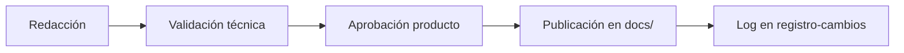

# Control de configuración documental — 2x3crmtest

| Campo | Valor |
|-------|--------|
| **ID de elemento de configuración** | `CI-DOCS-ERP-2X3` |
| **Norma** | ISO/IEC 29110 (gestión de configuración y documentación) |
| **Producto** | 2x3crmtest / 2x3 Operaciones |
| **Versión de este control** | `1.0.0` |
| **Fecha** | 2026-08-11 |

---

## 1. Propósito

Garantizar que los manuales y la base de conocimiento:

1. Tengan **identidad y trazabilidad** (título, versión de software, fecha, fabricante).  
2. Se actualicen **en paralelo** al ciclo de desarrollo (no al final).  
3. Dejen **evidencia auditable** de quién redactó, validó y aprobó.  
4. Queden sincronizados cuando el software pase de una versión a otra (p. ej. `1.0.0` → `1.1.0`).

---

## 2. Inventario de elementos de configuración (documentos)

| ID | Documento | Ruta | Tipo | Sincroniza con |
|----|-----------|------|------|----------------|
| `DOC-MU-001` | Manual de usuario | `docs/manual-usuario/manual-usuario-erp-supermercado.md` | Usuario final | Versión app (`package.json`) |
| `DOC-MT-001` | Manual técnico | `docs/manual-tecnico/manual-tecnico-erp-supermercado.md` | Ingeniería | Versión app + APIs |
| `DOC-MS-001` | Especificación maestra | `docs/arquitectura/2x3crmtest-master-spec.md` | Arquitectura | Roadmap / releases |
| `DOC-RE-001` | Revisión ejecutiva estado actual | `docs/arquitectura/revision-ejecutiva-estado-actual.md` | Calidad / auditoría | Release bajo revisión |
| `DOC-GE-001` | Guía de estilo documentación | `docs/calidad/guia-estilo-documentacion.md` | Proceso | Política documental |
| `DOC-RC-001` | Registro de cambios documentación | `docs/calidad/registro-cambios-documentacion.md` | Trazabilidad | Cada cambio DOC-* |
| `DOC-KB-001` | Índice base de conocimiento | `docs/README.md` | Portal documental | Todos los DOC-* |

Cada archivo anterior es un **elemento de configuración**: no se edita “de memoria”; se versiona en Git con mensaje que cite el ID (`docs(DOC-MU-001): …`).

---

## 3. Regla de sincronización software ↔ manual

| Evento de software | Acción documental obligatoria |
|--------------------|-------------------------------|
| Cambio que afecta una **tarea de usuario** (POS, caja, inventario, finanzas, login) | Actualizar `DOC-MU-001` en el mismo PR o en PR enlazado antes del merge a producción |
| Cambio de API, env, Docker o auth | Actualizar `DOC-MT-001` |
| Release con bump de `package.json` version | Actualizar tablas de identidad en manuales + fila en `DOC-RC-001` |
| Hallazgo de brecha funcional | Actualizar `DOC-RE-001` si cambia el dictamen ejecutivo |

**Formato de versión documental:** `{versión-software}-{sigla}`  
Ejemplo: software `1.0.0` → manual usuario `1.0.0-MU`, manual técnico `1.0.0-MT`.

---

## 4. Flujo de aprobación (evidencia auditable)

*Texto alternativo: Redacción → Validación técnica → Aprobación de producto → Publicación en docs → Registro de cambios.*

| Paso | Quién | Evidencia mínima |
|------|-------|------------------|
| Redacción | Autor del documento | Commit / PR con ID DOC-* |
| Validación técnica | Quien conoce el módulo | Comentario de aprobación en PR o fila firmada en registro |
| Aprobación para clientes | Dueño de producto | Visto bueno explícito en `registro-cambios-documentacion.md` |
| Publicación | Merge a rama principal | Tag o nota de release que cite versión documental |

Firmas digitales aceptadas: aprobación en GitHub PR, correo archivado, o fila completada en el registro de cambios (nombre + fecha + rol).

---

## 5. Desarrollo paralelo (no “al final”)

Checklist en cada historia de usuario que toque UI o flujo operativo:

- [ ] ¿Se agregó o cambió una tarea del manual de usuario?  
- [ ] ¿Hay código de error nuevo que deba ir a Troubleshooting?  
- [ ] ¿Cambió un término del glosario?  
- [ ] ¿Se actualizó el índice `docs/README.md` si nació un documento nuevo?

La documentación incompleta **bloquea** la definición de “terminado” de la historia (Definition of Done documental).

---

## 6. Factor 2026 — base de conocimiento digital

| Enfoque tradicional | Enfoque adoptado aquí |
|---------------------|------------------------|
| PDF único e inmóvil | Markdown versionado en `docs/` (wiki del repo) |
| Índice estático solo en papel | `docs/README.md` + índice de tareas dentro del manual |
| Actualización anual | Actualización por release / PR |
| Lectura pasiva | Tareas buscables por objetivo (“Cómo cobrar…”) |

**Métricas de uso (siguiente fase):** cuando exista ayuda in-app, registrar búsquedas frecuentes y artículos más abiertos para priorizar rediseño UX. Mientras tanto, usar issues etiquetados `docs-feedback`.

---

## 7. Responsables actuales

| Rol | Asignación |
|-----|------------|
| Dueño de documentación | Equipo 2x3 / Leo A. Paredes |
| Validador técnico por módulo | Pendiente asignar (POS, Inventario, Finanzas, AI) |
| Aprobador de liberación | Pendiente asignar |
