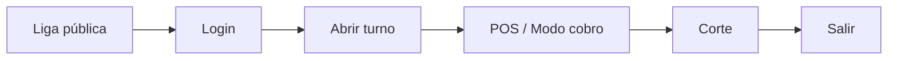
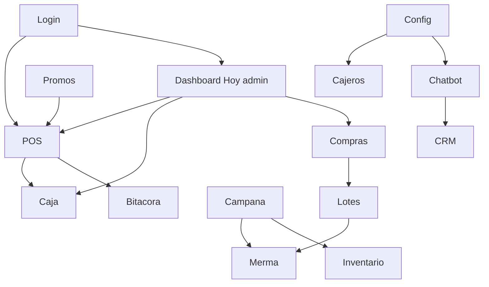

# Manual de usuario — ERP 2x3 Operaciones

| Campo | Valor |
|-------|--------|
| **ID** | `DOC-MU-001` |
| **Título** | Manual de usuario — ERP 2x3 Operaciones |
| **Producto** | `2x3crmtest` · marca en pantalla **2x3 Operaciones** |
| **Versión del software** | `1.0.0` |
| **Versión del documento** | `1.3.1-MU` |
| **Fecha** | 11 de agosto de 2026 |
| **Fabricante** | Leo A. Paredes / proyecto 2x3crmtest |
| **Liga de servicio** | [https://2x3crmtest.vercel.app](https://2x3crmtest.vercel.app) |
| **Login** | [https://2x3crmtest.vercel.app/login](https://2x3crmtest.vercel.app/login) |
| **Último commit incluido** | `1daff02` — *fix: resolve set-state-in-effect lint errors in POS and merma* |
| **Commits cubiertos** | `9366f92` lotes · `9e9298f` promos · `831d936` turnos/crédito/Hoy · `5fde201` modo cobro · `d7aa8a1` kg/pz · `2f85879` alertas archivados / badge Mínimo · `1daff02` POS/merma estabilidad UI |
| **Repositorio** | https://github.com/LeoAParedes/2x3crmtest |
| **Normas** | ISO/IEC/IEEE 26514 · ISO/IEC 25000 · ISO/IEC 29110 |

> Control de cambios: [`docs/calidad/registro-cambios-documentacion.md`](../calidad/registro-cambios-documentacion.md)

---

## 1. Para quién es este manual

| Audiencia | Qué cubre |
|-----------|-----------|
| **Cajero** | Login, turno, POS (catálogo + modo cobro), crédito, promos auto, quitar línea con clave admin, corte, bitácora propia, consulta de inventario, merma por lote, campana de alertas |
| **Administrador** | Todo lo del cajero + Dashboard Hoy, finanzas, compras con lotes, promociones, ajustes de inventario, configuración (IVA, cajeros, chatbot/WhatsApp) |
| **Desarrollador** | Use el [manual técnico](../manual-tecnico/manual-tecnico-erp-supermercado.md) |

**Roles reales:** `admin` y `cashier`.

---

## 2. Requisitos previos

- Navegador actualizado; acceso a **https://2x3crmtest.vercel.app**
- Cuenta entregada por el administrador
- Para vender: fondo de caja y **horario de turno** (06:00–14:00 o 14:00–22:00, zona del negocio)
- Pop-ups permitidos si imprime tickets
- Tablet/caja: recomendado **Modo cobro** + F11 a pantalla completa

---

## 3. Inicio rápido

1. Abra la liga de servicio → **Entrar al sistema**.  
2. Inicie sesión (cajero → `/pos`; admin → `/admin` **Hoy**).  
3. Cajero: abra turno con fondo → venda → un corte por franja → **Cerrar sesión**.  
4. Admin: cree cajeros, compras con caducidad de lote y promociones antes del día de venta.

*Texto alternativo: Liga pública → Login → Abrir turno → POS → Corte → Salir.*

---

## 4. Cómo iniciar y cerrar sesión

1. https://2x3crmtest.vercel.app/login  
2. **Usuario** + **Contraseña** → **Iniciar sesión**  
3. **Salir** en el menú (cuando no esté bloqueado post-corte)

Tras el corte, el cajero queda en `must_logout`: solo ve el resultado y **Cerrar sesión**.

---

## 5. Campana de alertas (todos los roles con shell)

En el encabezado, el ícono **🔔 Alertas** se actualiza cada ~60 s y **no usa caché** (siempre pide datos frescos al servidor).

| Tipo | Etiqueta | Destino al hacer clic |
|------|----------|------------------------|
| Caducidad | **Vencido** o **Caduca mañana** | `/inventario/merma-caducidad?lotId=…` |
| Stock | **Stock bajo** | `/inventario` |

- Vacío: `Sin alertas de stock ni caducidad.`  
- **No** incluye productos **archivados** (filtro en servidor y también en la campana): aisle `archived`, SKU/nombre con “archived”/“Archivado”.  
- Al armar alertas el sistema **repara/cierra lotes** ligados a catálogo archivado para que no reaparezcan.  
- Caducidad: solo **vencidos (hoy o antes)** o **exactamente mañana** (zona del negocio).  
- Cantidades de caducidad se muestran en **kg** o **pz**; stock bajo puede verse con el número interno de existencias.

---

## 6. Módulo POS (cajero y admin en caja)

**Ruta:** https://2x3crmtest.vercel.app/pos

### 6.1 Menú del cajero

| Ve | No ve / no usa |
|----|----------------|
| POS, Bitácora, Inventarios, Merma y Caducidad, Turno/Corte, Carrito, Campana | Dashboard Hoy, Finanzas, Configuración, **Ajuste rápido** |

### 6.2 Reglas de turno

| Regla | Comportamiento |
|-------|----------------|
| Mañana | 06:00–14:00 |
| Tarde | 14:00–22:00 |
| Fuera de horario | `Fuera de horario de turno (06:00–14:00 o 14:00–22:00)` |
| Un corte por franja | `Este turno del día ya fue cerrado. Solo un corte por turno.` |
| Un solo cajero en turno | `Solo puede haber un cajero en turno. Ahora opera: {usuario}…` |
| Admin exento | Puede abrir aunque haya cajero activo |
| Post-corte | Debe cerrar sesión antes de reabrir |

Sin turno no se cobra.

### 6.3 Abrir turno

**POS — Abre tu turno para vender**

1. Si otro cajero opera, verá el aviso de sesión exclusiva.  
2. **Fondo de apertura (MXN)** (default `500`) → **Abrir turno y vender**.  
3. Encabezado: **Caja activa: {usuario}** + reloj.

También desde `/caja` → **Fondo inicial** → **Abrir turno** → **Ir al POS**.

### 6.4 Vista catálogo + carrito

1. **Buscar SKU o producto**; ordenar por nombre/SKU/stock/precio.  
2. **Agregar**; ajustar **pz** (mín. 1) o **kg** (mín. 0.25, pasos 0.25; peso fijo en kg).  
3. Abrir **Carrito**.  
4. Indicadores de borrador: `Sincronizando con servidor…` · `Guardado en servidor` · `Error al sincronizar` · `Sin cambios pendientes`.

El borrador guarda carrito, pago, monto recibido y datos de crédito en el servidor (y cookie local).

### 6.5 Modo cobro

1. Active el interruptor **Modo cobro** (preferencia en el navegador; se sincroniza entre pestañas del mismo equipo).  
2. Use F11 para pantalla completa.  
3. **Búsqueda por código / SKU** + Enter o **+**.  
4. **Recibo en vivo** con − / + / **Quitar**.  
5. **Centro de pago:** subtotal, **Descuentos · {promo}**, IVA/impuesto, total.  
6. **Efectivo / Tarjeta / Crédito** → **Cobrar**.  
7. **Salir modo cobro** para volver al catálogo.

### 6.6 Medios de pago

| Medio | Campos | Regla |
|-------|--------|-------|
| Efectivo | Monto recibido | ≥ total |
| Tarjeta | — | Suma a ventas tarjeta del turno |
| Crédito | Nombre (≥2) y Teléfono (≥7) | Obligatorios |

### 6.7 Quitar línea del carrito

- Admin: quita directo.  
- Cajero: modal **Autorización requerida** → **Usuario administrador** + **Clave de administrador** → **Autorizar**.  
- Cada vez que se abre el modal arranca limpio (`admin` + clave vacía); Escape o clic fuera cancela.  
- Solo **quitar** la línea pide clave; − / + no.

### 6.8 Promociones en el ticket

El POS carga promos activas. Se aplica sola la de **mayor ahorro** (2×1, 3×2, %, monto fijo, bundle). El ticket muestra subtotal, descuento y total.

### 6.9 Cobrar

Vista normal: **Cobrar y emitir ticket**. Modo cobro: **Cobrar**.  
Modal **Recibo de venta** → **Mostrar impresión** / **Cerrar**.

Al cobrar: baja stock/lotes, actualiza turno, bitácora y descuentos.

---

## 7. Corte de caja

**Ruta:** https://2x3crmtest.vercel.app/caja · título **Turno y corte de caja**

1. Revise resumen del turno abierto: **Inicio**, **Fondo inicial**, **Ventas efectivo**, **Ventas tarjeta**, **Tickets**.  
   > En esta pantalla **no** se listan “Ventas crédito”; el crédito del día se ve en el Dashboard **Hoy** (admin).  
2. Conteo **ciego**: capture **Efectivo contado** (+ **Notas** opcionales).  
3. **Confirmar corte** (una vez por franja).  
4. Revise Esperado / Contado / Diferencia.  
5. Cajero: **Cerrar sesión**.

Admin: historial de cortes en la misma pantalla y en **Finanzas → Fondos activo**.  
Atajo admin en Configuración → pestaña **Turno / Corte** → **Ir a Turno / Corte**.

---

## 8. Inventario

**Ruta:** https://2x3crmtest.vercel.app/inventario

### 8.1 Lectura común (admin y cajero)

- Título operativo de inventario; búsqueda por Producto, SKU, Categorías, Precios, Unidad, Stock.  
- Columnas incluyen **Tipo** = `Peso` | `Pieza`.  
- Stock visible como **`X.XXX kg`** o **`N pz`** (la UI no habla en gramos).  
- Badge **Stock bajo (Mínimo …)** — el mínimo es el umbral configurado del SKU.  
- En listados de alerta local: `Stock {actual} / Mínimo {umbral}`.  
- Engranaje: **Ver códigos archivados** → badge **Archivado**.  
- Campana local de stock bajo además de la campana global.

### 8.2 Solo cajero

- Solo panel de consulta.  
- **No** ve pestaña **Ajustes**, ni **Agregar producto nuevo**, ni **Importación**.  
- El atajo de menú **Ajuste rápido** no aparece; si intenta ajustar: `Solo administradores pueden aplicar ajustes de inventario`.

### 8.3 Solo administrador — Ajustes

1. Pestaña **Ajustes** o menú **Ajuste rápido**.  
2. Operaciones: corregir precio, programar precio, entrada, salida, umbral stock bajo, eliminar (fila o lote).  
3. Entradas/salidas en **kg** o **pz** según el producto.  
4. Valoración de salida: **FIFO** | **Promedio**.  
5. **Agregar producto nuevo** (SKU, nombre, categoría, stock, precio, umbral, pasillo).  
6. **Importación** CSV (`sku,producto,categoria,unidad,precio,stock`).

El tipo peso/pieza puede inferirse por categoría/pasillo/nombre (granel, frutas, carnes, etc.).

---

## 9. Merma y caducidad (lotes FEFO)

**Ruta:** https://2x3crmtest.vercel.app/inventario/merma-caducidad  
**Quién:** admin **y cajero** (ambos pueden registrar salida de lote).

1. Revise **Alertas (1 día antes y vencidos)** con etiquetas **Vencido** / **Caduca mañana** y botón **Seleccionar lote**.  
2. En **Dar salida por merma (lote)** elija **Lote**.  
3. **Cantidad a sacar (kg|pz)** — al cambiar de lote se propone sola `0.100` kg o `1` pz; si edita la cantidad, se conserva mientras ese lote siga seleccionado.  
4. **Motivo** (default `Merma por caducidad`).  
5. **Registrar salida del lote**.  
6. Éxito ejemplo: `Salida registrada del lote {sku} · {qty} · caduca {fecha}` (luego la cantidad vuelve al default del lote).

Deep link desde la campana: `?lotId=…` preselecciona el lote.  
Baja el restante del lote y el stock del SKU (sale primero lo que caduca antes / vencido).

---

## 10. Compras y proveedores (admin)

**Ruta:** `/finanzas/compras`

1. **Registrar entrada** → formulario **Nueva entrada**.  
2. Buscar por **Nombre** o **SKU**; elija producto (muestra kg/pz y precio).  
3. **Cantidad (kg)|(pz)**, **Costo unitario**.  
4. **Caducidad del lote** (fecha **obligatoria**) — crea el lote en base de datos.  
5. **Forma de pago:** `Contado (egreso en finanzas)` | `Crédito (cuenta por pagar)`.  
6. **Proveedor existente** u **O crear proveedor**; **Vendido / entregado por**.  
7. **Guardar entrada**.

Tablas: **Proveedores · cuentas por pagar**, **Compras recientes**, **Alertas de restock** con botón **Entrada**.  
Un SKU puede tener **varios lotes** (varias caducidades).

---

## 11. Promociones (admin → efecto en POS)

**Ruta:** `/finanzas/promociones`

1. **Nueva promoción**.  
2. **Nombre**, **Tipo de descuento:** Porcentaje (%), Monto fijo ($), **2 × 1**, **3 × 2**, **Paquete / bundle**.  
3. **Valor**, **Compra mínima (MXN)**, **Descripción**, **Inicia**, **Expira**.  
4. **Seleccionar productos** (modal de búsqueda).  
   - 2×1 / 3×2: al menos 1 producto.  
   - Bundle: al menos 2 productos + **Cant.** requerida por SKU; valor de descuento fijo > 0.  
5. **Activa al crear** → **Guardar**.  
6. Lista: contadores activas/inactivas; **Activar** / **Desactivar** / **Eliminar**.

En caja se aplica sola la de mayor ahorro (§6.8).

---

## 12. Finanzas (admin)

**Ruta:** `/finanzas`

- Periodos **Hoy / Semana / Mes** con refresh ~15 s.  
- KPIs: Ingresos, Egresos, Ganancia, Ticket promedio.  
- Si hubo promos: línea **Descuentos {MXN}**.  
- Leaderboard y atajos a Periodos, Fondos, Pasivo, Compras, Promociones.

| Submódulo | Uso |
|-----------|-----|
| Periodos | P&L por fechas + registrar gasto |
| Fondos activo | Lectura de caja y cortes |
| Pasivo | Gastos (renta, luz, nómina, etc.) |
| Compras | §10 |
| Promociones | §11 |

---

## 13. Dashboard Hoy (admin)

**Ruta:** https://2x3crmtest.vercel.app/admin · título **Hoy**  
Refresh manual + automático ~30 s. `/operaciones` redirige aquí.

| Widget | Contenido |
|--------|-----------|
| Ventas hoy | Total, tickets; **Descuentos** si > 0 |
| Caja / turno | Fuera de horario · Turno mañana · Turno tarde · Sin turno; sesión abierta o no; enlace a `/caja` |
| Medios de pago | **Efectivo**, **Tarjeta**, **Crédito** |
| Alertas | Contador stock bajo + caducidad; listas con enlaces |
| Atajos | Cobrar en POS, Turno/Corte, Entrada de compra, Registrar gasto (y otros según API: merma/promos) |

---

## 14. Configuración (admin)

**Ruta:** `/configuracion` · pestañas **General** | **Chatbot** | **Cajeros** | **Turno / Corte**

| Pestaña | Qué hacer |
|---------|-----------|
| General | **Mostrar IVA en el precio final del recibo**; **Tasa de IVA predeterminada (%)** → Guardar |
| Cajeros | Usuario + contraseña → **Crear cajero**; listado Activo/Inactivo/Gate |
| Turno / Corte | Explica apertura y corte ciego; CTA **Ir a Turno / Corte** → `/caja` (el POS pide abrir turno sin sacar del módulo) |
| Chatbot (DavinciAi) | **Agente activo**, **Modelo**, **Instrucciones**, **Acciones de escritura**, **Acciones financieras**, checkboxes de **Herramientas ERP** (ventas de hoy, stock, stock bajo, POS recientes, etc.), estado `OPENAI_API_KEY lista` / falta en Vercel, **Guardar**, enlace **Consola web** → `/crm`, sección **WhatsApp (Twilio)** con Webhook URL + **Copiar** |

Canales Evolution/Meta se configuran fuera de esta pantalla (ver docs de integración).

---

## 15. Bitácora

**Ruta:** `/bitacora`

| Pestaña | Uso |
|---------|-----|
| **Actividad** | Filtros por tipo, categoría (Ventas/Inventario/POS/CRM/Sistema), estado, usuario; **Ver ticket** / Imprimir |
| **Ventas recientes** | Listado de ventas (pago puede verse como `cash`/`card`/`credit`) |

Cajero: solo **sus** registros. Admin: todos.

---

## 16. Consola CRM / agente

**Ruta:** https://2x3crmtest.vercel.app/crm (desde Configuración → Consola web; **no** está en el menú lateral).

Quick actions: Inventario, Pedidos, Finanzas, Devoluciones, Handoff humano.  
Revise intent, run mode, handoff y Session ID al reportar fallos.  
Es consola de prueba del asistente omnicanal (mismo cerebro que WhatsApp), no un CRM de contactos.

---

## 17. Mapa de módulos completo

*Texto alternativo: el login reparte a POS o Hoy; compras crean lotes para merma; promos alimentan el POS; la campana lleva a inventario/merma; config alimenta cajeros y chatbot/CRM.*

---

## 18. Resolución de problemas

| Síntoma | Qué hacer |
|---------|-----------|
| Fuera de horario / franja ya cerrada | Espere 06–14 o 14–22; un corte por franja |
| Otro cajero en turno | Espere su corte/logout o pida al admin |
| No cobra | Abra turno; en crédito complete nombre y teléfono |
| No puede quitar línea | Autorice con clave admin |
| Error al sincronizar borrador | Revise red; no cierre si aún no cobró |
| Promo no aplica | Vigencia, productos y cantidades (2×1/3×2/bundle) |
| Sin caducidad / stock archivado en campana | Normal: archivados se excluyen y la campana no cachea; refresque o espere ~60 s |
| Badge dice Mínimo y no “umbral” | Es el umbral de stock bajo del producto (texto actual de la UI) |
| Merma rechazada | Elija lote y cantidad ≤ restante (kg/pz) |
| No ve Ajustes / Finanzas | Rol cajero (normal) |
| Crédito no aparece en `/caja` | Normal; véalo en Dashboard Hoy |
| Chatbot sin respuesta | Revise OPENAI_API_KEY y Session ID en `/crm` |
| Impresión bloqueada | Permita pop-ups del sitio |

Reporte: fecha/hora, usuario, URL, pasos, mensaje, modo cobro sí/no, ID venta o Session ID.

---

## 19. Buenas prácticas

- Una cuenta por persona; cierre sesión tras el corte.  
- Un cajero en turno; respete horarios.  
- Caducidad solo vía **lotes de compra**, no notas locales.  
- Prefiera modo cobro en caja física.  
- No quite líneas sin autorización.  
- Verifique **Guardado en servidor** en tickets largos.

---

## 20. Glosario

| Término | Significado |
|---------|-------------|
| Liga de servicio | https://2x3crmtest.vercel.app |
| kg / pz | Unidades en pantalla; peso en kg con 3 decimales |
| Lote | Entrada de compra con una caducidad |
| FEFO | Sale primero lo que caduca antes / vencido |
| Modo cobro | POS a pantalla completa para escáner/tablet |
| Sesión exclusiva | Solo un cajero con turno abierto |
| Franja | Mañana 06–14 o tarde 14–22 |
| Corte ciego | Contado sin ver esperado antes |
| Autorización admin | Clave para quitar líneas del carrito |
| Crédito POS | Venta con nombre y teléfono |
| Archivado | SKU fuera de alertas (detección ampliada: aisle/SKU/nombre con archived/Archivado) |
| Mínimo | Umbral de stock bajo mostrado en badges `Stock bajo (Mínimo …)` |
| DavinciAi | Asistente web/WhatsApp |
| must_logout | Bloqueo post-corte |

---

## 21. Índice de tareas

| Quiero… | § |
|---------|---|
| Entrar por la liga pública | 3 |
| Ver alertas de stock/caducidad | 5 |
| Abrir turno / modo cobro / crédito / quitar línea | 6 |
| Hacer corte | 7 |
| Consultar inventario kg/pz | 8 |
| Registrar merma de lote | 9 |
| Comprar con caducidad | 10 |
| Crear 2×1 / 3×2 / bundle | 11 |
| Ver descuentos en finanzas | 12 |
| Usar Dashboard Hoy | 13 |
| Configurar IVA / cajeros / WhatsApp | 14 |
| Reimprimir ticket | 15 |
| Probar el agente | 16 |
| Resolver un error | 18 |

---

## 22. Documentos relacionados

| Documento | Uso |
|-----------|-----|
| [Índice KB](../README.md) | Portal documental |
| [Manual técnico](../manual-tecnico/manual-tecnico-erp-supermercado.md) | APIs / deploy |
| [Control documental](../calidad/control-configuracion-documental.md) | Versiones |
| [Registro de cambios](../calidad/registro-cambios-documentacion.md) | Trazabilidad |

---

## 23. Aprobación

| Rol | Nombre | Fecha | Evidencia |
|-----|--------|-------|-----------|
| Redacción | Leonardo Antonio Paredes | 2026-08-11 | `1.3.1-MU` incluye `2f85879` + `1daff02` |
| Validación técnica | Leonardo Antonio Paredes | — | https://2x3crmtest.vercel.app |
| Aprobación clientes | Leonardo Antonio Paredes | — | registro de cambios |

Software `1.0.0` · documento **`1.3.1-MU`** · último commit `1daff02` · liga de servicio https://2x3crmtest.vercel.app
