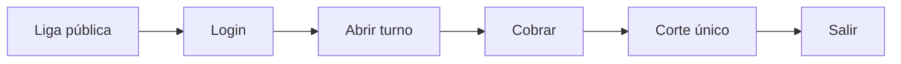

# Manual de usuario — ERP 2x3 Operaciones

| Campo | Valor |
|-------|--------|
| **ID** | `DOC-MU-001` |
| **Título** | Manual de usuario — ERP 2x3 Operaciones |
| **Producto** | `2x3crmtest` (marca en pantalla: **2x3 Operaciones**) |
| **Versión del software** | `1.0.0` (según `package.json`) |
| **Versión del documento** | `1.1.0-MU` |
| **Fecha de publicación** | 11 de agosto de 2026 |
| **Fabricante / responsable** | Leo A. Paredes / proyecto 2x3crmtest |
| **Liga de servicio (producción)** | [https://2x3crmtest.vercel.app](https://2x3crmtest.vercel.app) |
| **Portal de acceso** | [https://2x3crmtest.vercel.app/login](https://2x3crmtest.vercel.app/login) |
| **Repositorio** | https://github.com/LeoAParedes/2x3crmtest |
| **Normas de referencia** | ISO/IEC/IEEE 26514 · ISO/IEC 25000 (usabilidad) · ISO/IEC 29110 (control documental) |
| **Idioma** | Español (México) |

> **Control de cambios:** registre cada actualización en  
> [`docs/calidad/registro-cambios-documentacion.md`](../calidad/registro-cambios-documentacion.md).

---

## 1. Para quién es este manual

| Audiencia | Uso |
|-----------|-----|
| **Cajero** | Abrir turno, vender (efectivo/tarjeta/crédito), corte, bitácora, merma por lote |
| **Administrador / dueño** | Todo lo anterior + dashboard Hoy, finanzas, compras con caducidad, promociones, configuración |
| **Almacén** | Entradas con lote/caducidad, merma FEFO, alertas de la campana |
| **Desarrolladores** | Use el [manual técnico](../manual-tecnico/manual-tecnico-erp-supermercado.md) |

**Roles en el software:** `admin` y `cashier`.

---

## 2. Requisitos previos

- Navegador actualizado (Chrome, Edge o Firefox).
- Cuenta entregada por el administrador.
- Acceso a la liga de servicio: **https://2x3crmtest.vercel.app**
- Para caja: conocer el fondo de apertura autorizado.

---

## 3. Inicio rápido (primera venta)

1. Abra [https://2x3crmtest.vercel.app](https://2x3crmtest.vercel.app) → **Entrar al sistema**.  
2. Inicie sesión (cajero → POS).  
3. En horario de turno (**06:00–14:00** o **14:00–22:00**, zona del negocio), abra turno con fondo.  
4. Agregue productos al carrito y cobre (efectivo, tarjeta o crédito).  
5. Al terminar el turno, haga **un solo corte** y cierre sesión.

*Texto alternativo: Liga pública → Login → Abrir turno → Cobrar → Corte → Salir.*

---

## 4. Cómo iniciar y cerrar sesión

1. Vaya a `/login` o use la liga pública.  
2. Capture usuario y contraseña → **Iniciar sesión**.  
3. Admin llega a **Dashboard (Hoy)**; cajero a **POS**.  
4. **Salir** desde el menú lateral.

Tras el corte, el cajero queda en `must_logout`: solo puede cerrar sesión.

---

## 5. Cómo vender en el POS

### 5.1 Abrir turno

- Horarios: **mañana 06:00–14:00** · **tarde 14:00–22:00**.  
- Fuera de horario no se abre turno.  
- **Un cierre por turno** del día: si ya cortó el turno mañana, no vuelve a abrir mañana el mismo día.

### 5.2 Armar ticket y cobrar

1. Busque por nombre o SKU; agregue piezas o kg.  
2. Elija pago: **Efectivo**, **Tarjeta** o **Crédito**.  
3. Crédito: capture **nombre** y **teléfono** obligatorios.  
4. Si hay promoción vigente aplicable, el descuento se aplica **solo** (2x1, 3x2, porcentaje, monto fijo o bundle).  
5. **Cobrar y emitir ticket** — el ticket muestra subtotal, descuento (si hay), total.

### 5.3 Impacto

Al cobrar: baja stock, actualiza turno de caja, registra bitácora y descuentos en finanzas.

---

## 6. Cómo hacer el corte de caja

1. **Turno / Corte** (`/caja`).  
2. Cuente efectivo; capture **efectivo contado**.  
3. **Confirmar corte** (una vez por turno).  
4. Cajero: **Cerrar sesión**.

Historial admin: **Finanzas → Fondos activo**.

---

## 7. Inventario, lotes y caducidad

### 7.1 Consultar inventario

**Inventarios** — búsqueda, alertas de stock bajo (campana global 🔔).

### 7.2 Entrada por proveedor (crea el lote)

1. **Finanzas → Compras y Proveedores**.  
2. Producto, cantidad, costo, proveedor, contado/crédito.  
3. **Fecha de caducidad del lote** (obligatoria).  
4. **Guardar entrada**.

Eso crea un **lote** en la base de datos (Supabase). El mismo SKU puede tener varias caducidades (varias entradas).

### 7.3 Merma FEFO

1. **Merma y Caducidad** (o enlace desde la campana).  
2. Seleccione el **lote** (no solo el producto).  
3. Cantidad ≤ restante del lote → **Registrar salida del lote**.  
4. Baja el restante del lote y el stock del SKU.

### 7.4 Alertas de caducidad

La campana del encabezado avisa **1 día antes** y **vencidos**. Cada alerta lleva a merma del lote.

---

## 8. Promociones

1. **Finanzas → Descuentos y promociones**.  
2. Nueva promoción: tipo (`porcentaje`, `monto_fijo`, `2x1`, `3x2`, `bundle`), vigencia, valor.  
3. **Seleccionar productos** (modal).  
4. Bundle: indique **cantidad de cada SKU** y descuento fijo en pesos (ej. −$10 si entran juntos).  
5. En POS se aplica sola la de **mayor ahorro** si hay solape.

---

## 9. Finanzas

- **Finanzas**: ventas día/semana/mes y descuentos otorgados.  
- **Periodos**: P&L y gráficas.  
- **Pasivo**: gastos.  
- **Fondos**: lectura de caja.  
- **Compras**: entradas con lote.  
- Detalle analítico sigue en estos módulos; el Dashboard no los duplica.

---

## 10. Dashboard “Hoy” (admin)

`/admin` resume:

- Ventas y descuentos de hoy  
- Estado de caja / turno  
- Medios de pago (efectivo / tarjeta / crédito)  
- Alertas de stock y caducidad  
- Atajos a POS, compras, merma, promociones  

`/operaciones` redirige al hub admin para no duplicar ventanas.

---

## 11. Configuración

- IVA en recibo  
- Cajeros  
- Chatbot DavinciAi / webhooks WhatsApp  

Consola de prueba del agente: `/crm` (fuera del menú).

---

## 12. Bitácora

Filtre actividad, reimprima tickets, revise ventas recientes. El cajero solo ve lo suyo.

---

## 13. Resolución de problemas

| Síntoma | Qué hacer |
|---------|-----------|
| No abre turno | Verifique horario 06–14 / 14–22 o si ese turno ya se cerró hoy |
| No cobra | Abra turno; en crédito complete nombre y teléfono |
| Promoción no baja precio | Verifique vigencia, productos del modal y cantidades (2x1/3x2/bundle) |
| Sin caducidad en campana | La fecha solo existe si la entrada de compra creó el lote |
| Merma rechazada | Elija lote y cantidad ≤ restante |
| No ve Finanzas | Rol cajero (normal) |

Reporte: fecha/hora, usuario, módulo, pasos, mensaje/código, ID de venta.

---

## 14. Buenas prácticas

- Una cuenta por persona; cierre sesión al terminar.  
- Caducidad solo vía lote en compras (no anotes solo en el navegador).  
- Un corte por turno.  
- No comparta contraseñas.

---

## 15. Glosario

| Término | Significado |
|---------|-------------|
| **Liga de servicio** | URL pública del ERP: https://2x3crmtest.vercel.app |
| **Lote** | Entrada de compra con una caducidad; un SKU puede tener varios |
| **FEFO** | Sale primero el lote que caduca antes / el vencido |
| **Turno mañana/tarde** | 06:00–14:00 / 14:00–22:00 |
| **Crédito (POS)** | Venta a crédito con nombre y teléfono |
| **Bundle** | Promo multi-SKU con cantidades y descuento fijo |
| **DavinciAi** | Asistente de negocio (web / WhatsApp) |

---

## 16. Índice de tareas

| Quiero… | Sección |
|---------|---------|
| Entrar por la liga pública | 3 |
| Cobrar / crédito / promos | 5 |
| Corte de caja | 6 |
| Comprar con caducidad | 7.2 |
| Merma por lote | 7.3 |
| Crear promoción / bundle | 8 |
| Ver dashboard Hoy | 10 |
| Resolver error | 13 |

---

## 17. Documentos relacionados

| Documento | Uso |
|-----------|-----|
| [Manual técnico](../manual-tecnico/manual-tecnico-erp-supermercado.md) | APIs y despliegue |
| [Control documental](../calidad/control-configuracion-documental.md) | Versiones y firmas |

---

## 18. Aprobación (ISO/IEC 29110)

| Rol | Nombre | Fecha | Evidencia |
|-----|--------|-------|-----------|
| Redacción | Leonardo Antonio Paredes  | 2026-08-11 | `docs/manual-usuario/` |
| Validación técnica | Leonardo Antonio Paredes  | — | Flujos en https://2x3crmtest.vercel.app |
| Aprobación clientes |Leonardo Antonio Paredes | — | `registro-cambios-documentacion.md` |

Versión de trabajo alineada al software `1.0.0` · documento `1.1.0-MU`.
