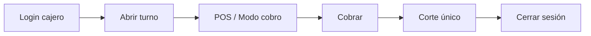
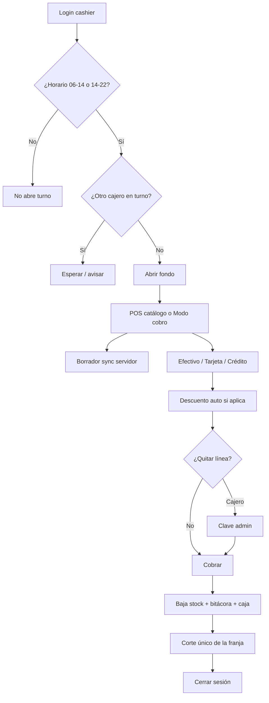

# Manual de usuario — ERP 2x3 Operaciones

| Campo | Valor |
|-------|--------|
| **ID** | `DOC-MU-001` |
| **Título** | Manual de usuario — ERP 2x3 Operaciones |
| **Producto** | `2x3crmtest` (marca en pantalla: **2x3 Operaciones**) |
| **Versión del software** | `1.0.0` |
| **Versión del documento** | `1.2.0-MU` |
| **Fecha de publicación** | 11 de agosto de 2026 |
| **Fabricante / responsable** | Leo A. Paredes / proyecto 2x3crmtest |
| **Liga de servicio (producción)** | [https://2x3crmtest.vercel.app](https://2x3crmtest.vercel.app) |
| **Portal de acceso** | [https://2x3crmtest.vercel.app/login](https://2x3crmtest.vercel.app/login) |
| **POS (cajero)** | [https://2x3crmtest.vercel.app/pos](https://2x3crmtest.vercel.app/pos) |
| **Turno / Corte** | [https://2x3crmtest.vercel.app/caja](https://2x3crmtest.vercel.app/caja) |
| **Commit de referencia POS** | `5fde201` — *feat(pos): add cobro mode and harden cashier operations* |
| **Repositorio** | https://github.com/LeoAParedes/2x3crmtest |
| **Normas** | ISO/IEC/IEEE 26514 · ISO/IEC 25000 · ISO/IEC 29110 |
| **Idioma** | Español (México) |

> **Control de cambios:** [`docs/calidad/registro-cambios-documentacion.md`](../calidad/registro-cambios-documentacion.md)

---

## 1. Para quién es este manual

| Audiencia | Uso principal |
|-----------|---------------|
| **Cajero** | Operar el **módulo POS completo**: turno, venta, modo cobro, crédito, promociones, corte y bitácora |
| **Administrador** | Supervisar caja, autorizar quitar líneas del carrito, finanzas, compras/lotes, promociones, configuración |
| **Desarrolladores** | [Manual técnico](../manual-tecnico/manual-tecnico-erp-supermercado.md) |

**Roles reales:** `admin` y `cashier`.

---

## 2. Requisitos previos (cajero)

- Navegador actualizado (Chrome, Edge o Firefox).
- Cuenta `cashier` creada por el administrador.
- Acceso a **https://2x3crmtest.vercel.app**
- Conocer el **fondo de apertura** autorizado.
- Estar en **horario de turno** (ver §5.2).
- Si va a imprimir tickets: permitir ventanas emergentes del sitio.
- Para tablet/caja: preferir **Modo cobro** a pantalla completa (F11 del navegador).

---

## 3. Inicio rápido — primera venta del cajero

1. Abra https://2x3crmtest.vercel.app → **Entrar al sistema**.  
2. Inicie sesión → el sistema lo lleva a **https://2x3crmtest.vercel.app/pos**.  
3. Si no hay otro cajero con turno abierto y está en horario, capture **Fondo de apertura (MXN)** (default `500`) → **Abrir turno y vender**.  
4. Active **Modo cobro** (recomendado) o use el catálogo + **Carrito**.  
5. Agregue productos, elija **Efectivo / Tarjeta / Crédito** y cobre.  
6. Al terminar el turno: **Turno / Corte** → un solo corte → **Cerrar sesión**.

*Texto alternativo: Login → Abrir turno → POS o modo cobro → Cobrar → Corte → Cerrar sesión.*

---

## 4. Cómo iniciar y cerrar sesión

1. Vaya a https://2x3crmtest.vercel.app/login  
2. Capture **Usuario** y **Contraseña** → **Iniciar sesión**.  
3. Destino del cajero: **POS** (`/pos`).  
4. **Salir** desde el menú lateral (cuando no esté bloqueado post-corte).

**Después del corte:** el cajero queda en estado `must_logout`. El menú desaparece; solo puede ver el resultado del corte y pulsar **Cerrar sesión**. No puede abrir otro turno hasta cerrar sesión.

---

## 5. Módulo POS para cajeros (implementación completa)

Esta sección describe **todo** el flujo operativo del POS según la actualización actual en `main` (modo cobro, sesión exclusiva, borrador en servidor, autorización admin para quitar líneas, crédito y promociones en ticket).

### 5.1 Qué ve el cajero en el menú

| Visible para cajero | No visible / no usable |
|---------------------|-------------------------|
| **POS** | Dashboard Hoy |
| **Bitácora** (solo lo suyo) | Finanzas y submódulos |
| **Inventarios** (consulta) | Configuración / Cajeros |
| **Merma y Caducidad** | **Ajuste rápido** (solo admin) |
| **Turno / Corte** (`/caja`) | Crear promociones, compras, IVA |

El ícono de **Carrito** del encabezado abre `/pos?openCart=1` (salvo bloqueo post-corte).

---

### 5.2 Reglas de turno (obligatorias antes de vender)

| Regla | Comportamiento real |
|-------|---------------------|
| Horario mañana | **06:00–14:00** (zona del negocio) |
| Horario tarde | **14:00–22:00** |
| Fuera de horario | No abre turno. Mensaje: `Fuera de horario de turno (06:00–14:00 o 14:00–22:00)` |
| Un corte por franja | Si ya cerró el turno mañana, **no** puede reabrir mañana el mismo día. Mensaje: `Este turno del día ya fue cerrado. Solo un corte por turno.` |
| Sesión exclusiva de cajero | **Solo un cajero** puede tener turno abierto a la vez. Si otro opera, verá: `Solo puede haber un cajero en turno. Ahora opera: {usuario}…` |
| Excepción admin | El administrador **sí** puede abrir turno aunque haya un cajero activo |
| Post-corte | Debe **cerrar sesión** antes de intentar abrir otro turno |

Sin turno abierto no hay cobro. Mensaje al intentar vender: equivalente a *debe abrir turno de caja*.

---

### 5.3 Cómo abrir el turno

**Desde POS** (pantalla **Abre tu turno para vender**):

1. Revise que no aparezca el aviso de otro cajero ocupando la caja.  
2. Capture **Fondo de apertura (MXN)** (mínimo 0; default `500`).  
3. Pulse **Abrir turno y vender**.  
4. Debe ver **Caja activa: {su usuario}**.

**Desde Turno / Corte** (`/caja`):

1. Capture **Fondo inicial (efectivo)**.  
2. Pulse **Abrir turno**.  
3. Use **Ir al POS**.

Errores frecuentes al abrir:

| Mensaje | Qué hacer |
|---------|-----------|
| `Fuera de horario de turno…` | Espere la franja 06–14 o 14–22 |
| `Solo puede haber un cajero en turno…` | Espere a que el otro cajero corte y cierre sesión, o pida apoyo al admin |
| `Ya tienes un turno abierto` | Vaya directo a vender en POS |
| `Este turno del día ya fue cerrado…` | Espere la siguiente franja (mañana↔tarde) o el día siguiente |
| `Debes cerrar sesión después del corte…` | Pulse **Cerrar sesión** e inicie de nuevo |

---

### 5.4 Vista normal del POS (catálogo + carrito)

**Ruta:** https://2x3crmtest.vercel.app/pos

1. Busque en **Buscar SKU o producto**.  
2. Ordene por nombre, SKU, stock o precio (ascendente/descendente).  
3. En cada fila pulse **Agregar**.  
4. Ajuste cantidades:
   - **pz** (pieza): mínimo 1  
   - **kg** (peso): mínimo 0.25, pasos de 0.25; productos de peso quedan fijos en `kg`  
5. Abra **Carrito** para ver líneas, totales y cobro.  
6. Reloj del turno visible en el encabezado del POS.

**Estado del borrador** (siempre visible en el panel de cobro):

| Indicador | Significado |
|-----------|------------|
| `Sincronizando con servidor…` | Guardando el carrito en tiempo real |
| `Guardado en servidor` | Borrador seguro en servidor (+ cookie local) |
| `Error al sincronizar` | Revise red; el carrito puede seguir en pantalla |
| `Sin cambios pendientes` | Nada nuevo por guardar |

El borrador guarda carrito, método de pago, monto recibido y datos de crédito. Si recarga o cambia de equipo con la misma sesión, puede recuperar la venta en curso.

---

### 5.5 Modo cobro (tablet / caja a pantalla completa)

Pensado para operación rápida con escáner o teclado.

**Cómo activarlo**

1. En POS, active el interruptor **Modo cobro**.  
2. La preferencia se recuerda en el navegador.  
3. Para pantalla completa use **F11** del navegador (recomendado en la propia UI).  
4. Para salir: **Salir modo cobro** (o desactivar el interruptor al volver a la vista normal).

**Qué hace el modo cobro**

| Zona | Uso |
|------|-----|
| **Búsqueda por código / SKU** | Escriba o escanee y pulse **Enter** o **+** |
| **Recibo en vivo** | Lista de líneas con precio y descuento por línea |
| **− / +** | Baja o sube cantidad |
| **Quitar** | Quita la línea (si es cajero, pide autorización admin — §5.7) |
| **Centro de pago** | Subtotal, descuentos (nombre de promo), IVA/impuesto, total |
| **Efectivo / Tarjeta / Crédito** | Medio de pago |
| **Monto recibido** | Solo efectivo; muestra **Cambio** |
| **Nombre / Teléfono** | Obligatorios en crédito |
| **Cobrar** | Confirma la venta (`Procesando…` mientras corre) |
| Indicador de sync | Mismo borrador en servidor que la vista normal |

Pantalla vacía: *Escanea un código para comenzar el ticket*.

---

### 5.6 Medios de pago

| Medio | Qué captura el cajero | Regla |
|-------|------------------------|-------|
| **Efectivo** | **Monto recibido** | Debe ser ≥ total; si no: `Monto recibido insuficiente…` |
| **Tarjeta** | Nada extra | Se registra como venta tarjeta en el turno |
| **Crédito** | **Nombre del cliente** (≥ 2 caracteres) y **Teléfono** (≥ 7) | Si faltan: `Nombre y teléfono del cliente son requeridos para venta a crédito` |

Los tres medios alimentan el resumen del turno y el dashboard **Hoy** del administrador.

---

### 5.7 Quitar un producto del carrito (autorización admin)

- **Administrador** en POS: puede quitar líneas sin clave extra.  
- **Cajero:** al pulsar **Quitar** / eliminar línea aparece **Autorización requerida**.

Modal:

1. Título: **Autorización requerida**  
2. Texto: *Para quitar un producto ya registrado en el carrito se necesita la clave del administrador.*  
3. Campos: **Usuario administrador** (default `admin`) y **Clave de administrador**  
4. Botones: **Cancelar** / **Autorizar** (`Validando…`)

Si la clave es incorrecta: `Clave de administrador inválida` (o mensaje equivalente).  
Subir o bajar cantidad con **+ / −** **no** pide clave; solo **quitar** la línea completa.

---

### 5.8 Promociones en el cobro

- El POS carga promociones activas desde el servidor (`/api/pos/promos`).  
- Si el carrito cumple una promo (2x1, 3x2, porcentaje, monto fijo o bundle), el descuento se aplica **solo**.  
- Si varias aplican, gana la de **mayor ahorro**.  
- En totales verá **Descuentos · {nombre de la promo}**.  
- El ticket refleja subtotal, descuento y total.

El cajero **no crea** promociones; eso lo hace el admin en Finanzas. Si no baja el precio: la promo no está vigente, no incluye esos SKU o faltan cantidades (2x1/3x2/bundle).

---

### 5.9 Cobrar y emitir ticket

1. Revise cantidades (sin vacíos, ceros ni negativos).  
2. Confirme medio de pago y datos de crédito si aplica.  
3. Vista normal: **Cobrar y emitir ticket**. Modo cobro: **Cobrar**.  
4. Modal **Recibo de venta** → **Mostrar impresión** o **Cerrar**.  
5. Puede reabrir el último ticket con **Ver ticket**.

**Al cobrar el sistema:**

1. Descuenta stock (y lotes según reglas de inventario).  
2. Suma la venta al turno (efectivo / tarjeta / crédito).  
3. Registra la operación en **Bitácora**.  
4. Aplica y contabiliza descuentos de promoción.  
5. Limpia el carrito y sincroniza borrador vacío.

Errores típicos al cobrar:

| Mensaje | Acción |
|---------|--------|
| Debe abrir turno / sesión de caja | Abra turno (§5.3) |
| Stock insuficiente… | Quite o reduzca el producto |
| Monto recibido insuficiente… | Ajuste el efectivo recibido |
| Nombre y teléfono… crédito | Complete ambos campos |
| Productos ya no disponibles | Recargue catálogo y arme de nuevo |
| Pop-ups bloqueados | Permita ventanas emergentes para imprimir |

---

### 5.10 Cómo hacer el corte de caja (cajero)

1. Abra **Turno / Corte** → https://2x3crmtest.vercel.app/caja  
2. Revise resumen: inicio, fondo, ventas efectivo/tarjeta/(crédito), tickets.  
3. El conteo es **ciego**: no ve el esperado hasta confirmar.  
4. Capture **Efectivo contado** y, si desea, **Notas**.  
5. **Confirmar corte** (una sola vez por franja de turno).  
6. Revise Esperado / Contado / Diferencia.  
7. Pulse **Cerrar sesión** (obligatorio).

---

### 5.11 Bitácora del cajero (después de vender)

1. Abra **Bitácora**.  
2. Filtre su actividad o revise **Ventas recientes**.  
3. En ventas propias: **Ver ticket** → **Imprimir**.  
4. Solo ve **sus** movimientos; no los de otros cajeros.

---

### 5.12 Inventario y alertas desde el rol cajero

- Puede **consultar** inventario y stock.  
- **Ajuste rápido** no aparece en su menú (solo admin).  
- Merma por **lote** (FEFO) depende de permisos de escritura; si falla, solicite al administrador.  
- La campana de alertas **no incluye SKUs archivados** (ya no ensucian stock bajo).  
- Caducidad válida nace de **compras con lote** (admin), no de notas locales del navegador.

---

### 5.13 Resumen del ciclo POS del cajero

*Texto alternativo: el cajero solo vende dentro de horario, con un único turno de cajero abierto, borrador sincronizado, pagos con crédito opcional, autorización admin para quitar líneas, cobro con promos, corte único y logout obligatorio.*

---

## 6. Tareas del administrador relacionadas con el POS

(Resumen; el cajero no ejecuta estas pantallas.)

| Tarea | Dónde |
|-------|-------|
| Ver ventas/caja/medios de hoy | Dashboard **Hoy** (`/admin`) |
| Crear cajeros | Configuración → Cajeros |
| IVA del recibo | Configuración |
| Entradas con **fecha de caducidad del lote** | Finanzas → Compras |
| Crear promociones / bundles | Finanzas → Descuentos y promociones |
| Ajustes de inventario | Inventarios → Ajuste rápido |
| Autorizar quitar línea en caja | Modal en el POS del cajero (clave admin) |
| Abrir turno aunque haya cajero | POS / Caja (exento de sesión exclusiva) |

`/operaciones` redirige al hub **Hoy** para no duplicar pantallas.

---

## 7. Inventario, lotes y caducidad (contexto para la venta)

1. Las compras del admin crean **lotes** con caducidad en base de datos.  
2. Un mismo SKU puede tener varias caducidades (varias entradas).  
3. Merma FEFO: se elige el **lote**, no solo el producto.  
4. La campana avisa **1 día antes** y **vencidos**; no lista archivados.

---

## 8. Promociones (alta admin → efecto en POS cajero)

1. Admin crea promo vigente y asocia productos (modal).  
2. Bundle: cantidades por SKU + descuento fijo.  
3. En el POS del cajero se aplica sola la de mayor ahorro (§5.8).

---

## 9. Finanzas y configuración (solo admin)

- Finanzas: resumen, periodos, pasivo, fondos, compras.  
- Configuración: IVA, cajeros, chatbot DavinciAi.  
- Consola agente: `/crm` (fuera del menú).

---

## 10. Resolución de problemas — POS cajero

| Síntoma | Causa probable | Qué hacer |
|---------|----------------|-----------|
| No abre turno | Fuera de horario | Espere 06–14 o 14–22 |
| No abre turno | Otro cajero activo | Espere su corte/logout o avise a admin |
| No abre turno | Ya cortó esa franja hoy | Use la otra franja o el día siguiente |
| No abre turno | Post-corte sin logout | **Cerrar sesión** e iniciar de nuevo |
| No cobra | Sin turno | Abrir turno (§5.3) |
| No cobra crédito | Faltan datos | Nombre (≥2) y teléfono (≥7) |
| No puede quitar línea | Pedirá clave admin | Llame al administrador al modal |
| `Error al sincronizar` | Red | Reintente; no cierre el navegador si aún no cobró |
| Promo no aplica | Reglas de promo | Verifique vigencia/SKU/cantidades con admin |
| No ve Ajuste rápido | Rol cajero | Normal; solo admin |
| No ve Finanzas | Rol cajero | Normal |
| Impresión falla | Pop-ups | Permita emergencias en el sitio |

**Reporte de incidente:** fecha/hora, usuario cajero, URL (`/pos` o `/caja`), pasos, mensaje exacto, si usaba **Modo cobro**, medio de pago, ID de venta si existe.

---

## 11. Buenas prácticas del cajero

- Una sola persona por cuenta; no compartir contraseña.  
- Respete horarios y el **un cajero en turno**.  
- Prefiera **Modo cobro** + pantalla completa en caja física.  
- No quite líneas sin autorización; pida al admin.  
- Verifique el indicador **Guardado en servidor** en ventas largas.  
- Un corte por franja; luego **Cerrar sesión** de inmediato.  
- No deje la sesión abierta al alejarse de la caja.

---

## 12. Glosario POS

| Término | Significado |
|---------|-------------|
| **Liga de servicio** | https://2x3crmtest.vercel.app |
| **Modo cobro** | Vista a pantalla completa orientada a escáner/tablet |
| **Sesión exclusiva de cajero** | Solo un `cashier` con turno abierto a la vez |
| **Franja / slot** | Turno mañana (06–14) o tarde (14–22) |
| **Corte ciego** | Captura el contado sin ver el esperado antes |
| **Borrador POS** | Carrito sincronizado en servidor en tiempo real |
| **Autorización admin** | Clave de administrador para quitar líneas del carrito |
| **Crédito (POS)** | Venta fiada con nombre y teléfono del cliente |
| **Promo auto** | Descuento aplicado solo al armar el ticket |
| **must_logout** | Bloqueo post-corte: solo cerrar sesión |

---

## 13. Índice de tareas (cajero primero)

| Quiero… | Sección |
|---------|---------|
| Entrar por la liga pública | 3 |
| Entender horarios y un solo cajero | 5.2 |
| Abrir turno | 5.3 |
| Vender en catálogo + carrito | 5.4 |
| Usar modo cobro / tablet | 5.5 |
| Cobrar con crédito | 5.6 |
| Quitar un producto (con admin) | 5.7 |
| Entender descuentos en caja | 5.8 |
| Emitir ticket | 5.9 |
| Hacer corte y salir | 5.10 |
| Reimprimir mi ticket | 5.11 |
| Resolver un bloqueo de caja | 10 |

---

## 14. Documentos relacionados

| Documento | Uso |
|-----------|-----|
| [Manual técnico](../manual-tecnico/manual-tecnico-erp-supermercado.md) | APIs y despliegue |
| [Control documental](../calidad/control-configuracion-documental.md) | Versiones y firmas |
| [Registro de cambios](../calidad/registro-cambios-documentacion.md) | Trazabilidad 29110 |

---

## 15. Aprobación (ISO/IEC 29110)

| Rol | Nombre | Fecha | Evidencia |
|-----|--------|-------|-----------|
| Redacción | Leonardo Antonio Paredes | 2026-08-11 | Actualización POS cajero `1.2.0-MU` (commit `5fde201`) |
| Validación técnica | Leonardo Antonio Paredes | — | Flujos en https://2x3crmtest.vercel.app/pos |
| Aprobación clientes | Leonardo Antonio Paredes | — | `registro-cambios-documentacion.md` |

Versión de trabajo alineada al software `1.0.0` · documento **`1.2.0-MU`** · foco: implementación completa del módulo POS para cajeros.
